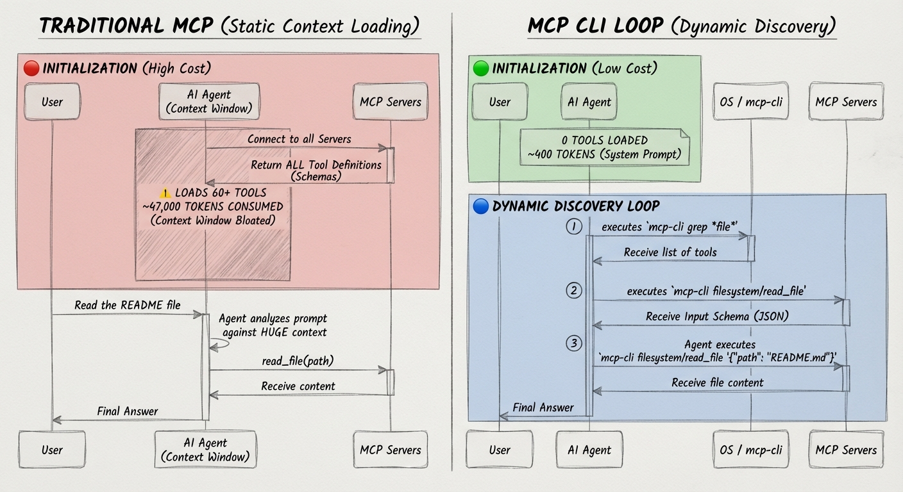

# mcp-cli

A lightweight Rust CLI and library for interacting with [MCP (Model Context Protocol)](https://modelcontextprotocol.io/) servers.

> [繁體中文](./README.md) | English

## Features

- 🪶 **Lightweight** - Minimal dependencies, blazing fast startup, written in pure Rust
- 📦 **Single Binary** - Compile to a single, fully-optimized standalone executable with zero external runtime dependencies via Cargo
- 🧰 **Rust Library** - Use the same MCP client functionality from other Rust applications
- 🔧 **Shell-Friendly** - JSON output for call, pipes with `jq`, chaining support
- 🤖 **Agent-Optimized** - Designed for AI coding agents (Gemini CLI, Claude Code, etc.)
- 🔌 **Universal** - Supports both stdio and HTTP MCP servers
- ⚡ **Connection Pooling** - Lazy-spawn daemon keeps connections warm (60s idle timeout)
- � **Tool Filtering** - Allow/disable specific tools per server via config
- 📋 **Server Instructions** - Display MCP server instructions in output
- �💡 **Actionable Errors** - Structured error messages with available servers and recovery suggestions



## Quick Start

### 1. Installation

```bash
curl -fsSL https://raw.githubusercontent.com/doggy8088/mcp-cli/main/install.sh | bash
```

or 

```bash
# requires Cargo installed
cargo install --git https://github.com/doggy8088/mcp-cli
```

### 2. Create a config file

Create `mcp_servers.json` in your current directory or `~/.config/mcp/`:

```json
{
  "mcpServers": {
    "filesystem": {
      "command": "npx",
      "args": [
        "-y",
        "@modelcontextprotocol/server-filesystem",
        "."
      ]
    },
    "deepwiki": {
      "url": "https://mcp.deepwiki.com/mcp"
    }
  }
}
```

### 3. Discover available tools

```bash
# List all servers and tools
mcp-cli

# With descriptions
mcp-cli -d
```

### 4. Call a tool

```bash
# View tool schema first
mcp-cli info filesystem read_file

# Call the tool
mcp-cli call filesystem read_file '{"path": "./README.md"}'
```

## Usage

```
mcp-cli [options]                             List all servers and tools
mcp-cli [options] info <server>               Show server tools and parameters
mcp-cli [options] info <server> <tool>        Show tool schema
mcp-cli [options] grep <pattern>              Search tools by glob pattern
mcp-cli [options] call <server> <tool>        Call tool (reads JSON from stdin if no args)
mcp-cli [options] call <server> <tool> <json> Call tool with JSON arguments
```

## Rust Library

Add the crate to another Rust project:

```toml
[dependencies]
mcp-cli = { git = "https://github.com/doggy8088/mcp-cli" }
```

Use `McpClient` for the common workflow:

```rust
use mcp_cli::McpClient;

#[tokio::main]
async fn main() -> Result<(), mcp_cli::CliError> {
    let client = McpClient::load(None)?;

    for server in client.server_names() {
        let tools = client.list_tools(&server).await?;
        println!("{server}: {} tools", tools.len());
    }

    let result = client
        .call_tool(
            "filesystem",
            "read_file",
            serde_json::json!({ "path": "./README.md" }),
        )
        .await?;

    println!("{}", mcp_cli::output::format_tool_result(&result));
    Ok(())
}
```

The crate also exposes lower-level modules such as `mcp_cli::client`, `mcp_cli::config`, `mcp_cli::errors`, and `mcp_cli::output` for callers that need direct control over connections or formatting.

**Both formats work:** `info <server> <tool>` or `info <server>/<tool>`

> [!TIP]
> Add `-d` to any command to include descriptions.

### Options

| Option | Description |
|--------|-------------|
| `-h, --help` | Show help message |
| `-v, --version` | Show version number |
| `-d, --with-descriptions` | Include tool descriptions |
| `-c, --config <path>` | Path to config file |

### Output

| Stream | Content |
|--------|---------|
| **stdout** | Tool results and human-readable info |
| **stderr** | Errors and diagnostics |

### Commands

#### List Servers

```bash
# Basic listing
$ mcp-cli
github
  • search_repositories
  • get_file_contents
  • create_or_update_file
filesystem
  • read_file
  • write_file
  • list_directory

# With descriptions
$ mcp-cli --with-descriptions
github
  • search_repositories - Search for GitHub repositories
  • get_file_contents - Get contents of a file or directory
filesystem
  • read_file - Read the contents of a file
  • write_file - Write content to a file
```

#### Search Tools

```bash
# Find file-related tools across all servers
$ mcp-cli grep "*file*"
github/get_file_contents
github/create_or_update_file
filesystem/read_file
filesystem/write_file

# Search with descriptions
$ mcp-cli grep "*search*" -d
github/search_repositories - Search for GitHub repositories
```

#### View Server Details

```bash
$ mcp-cli info github
Server: github
Transport: stdio
Command: npx -y @modelcontextprotocol/server-github

Tools (12):
  search_repositories
    Search for GitHub repositories
    Parameters:
      • query (string, required) - Search query
      • page (number, optional) - Page number
  ...
```

#### View Tool Schema

```bash
# Both formats work:
$ mcp-cli info github search_repositories
$ mcp-cli info github/search_repositories

Tool: search_repositories
Server: github

Description:
  Search for GitHub repositories

Input Schema:
  {
    "type": "object",
    "properties": {
      "query": { "type": "string", "description": "Search query" },
      "page": { "type": "number" }
    },
    "required": ["query"]
  }
```

#### Call a Tool

```bash
# With inline JSON
$ mcp-cli call github search_repositories '{"query": "mcp server", "per_page": 5}'

# JSON output is default for call command
$ mcp-cli call github search_repositories '{"query": "mcp"}' | jq '.content[0].text'

# Read JSON from stdin (no '-' needed!)
$ echo '{"path": "./README.md"}' | mcp-cli call filesystem read_file

```

#### Complex Commands

For JSON arguments containing single quotes, special characters, or long text, use **stdin** to avoid shell escaping issues:

```bash
# Using a heredoc (no '-' needed with call subcommand)
mcp-cli call server tool <<EOF
{"content": "Text with 'single quotes' and \"double quotes\""}
EOF

# From a file
cat args.json | mcp-cli call server tool

# Using jq to build complex JSON
jq -n '{query: "mcp", filters: ["active", "starred"]}' | mcp-cli call github search
```

**Why stdin?** Shell interpretation of `{}`, quotes, and special characters requires careful escaping. Stdin bypasses shell parsing entirely.

#### Advanced Chaining Examples

Chain multiple MCP calls together using pipes and shell tools:

```bash
# 1. Search and read: Find files matching pattern, then read the first one
mcp-cli call filesystem search_files '{"path": "src/", "pattern": "*.ts"}' \
  | jq -r '.content[0].text | split("\n")[0]' \
  | xargs -I {} mcp-cli call filesystem read_file '{"path": "{}"}'

# 2. Process multiple results: Read all matching files
mcp-cli call filesystem search_files '{"path": ".", "pattern": "*.md"}' \
  | jq -r '.content[0].text | split("\n")[]' \
  | while read file; do
      echo "=== $file ==="
      mcp-cli call filesystem read_file "{\"path\": \"$file\"}" | jq -r '.content[0].text'
    done

# 3. Extract and transform: Get repo info, extract URLs
mcp-cli call github search_repositories '{"query": "mcp server", "per_page": 5}' \
  | jq -r '.content[0].text | fromjson | .items[].html_url'

# 4. Conditional execution: Check file exists before reading
mcp-cli call filesystem list_directory '{"path": "."}' \
  | jq -e '.content[0].text | contains("README.md")' \
  && mcp-cli call filesystem read_file '{"path": "./README.md"}'

# 5. Save output to file
mcp-cli call github get_file_contents '{"owner": "user", "repo": "project", "path": "src/main.ts"}' \
  | jq -r '.content[0].text' > main.ts

# 6. Error handling in scripts
if result=$(mcp-cli call filesystem read_file '{"path": "./config.json"}' 2>/dev/null); then
  echo "$result" | jq '.content[0].text | fromjson'
else
  echo "File not found, using defaults"
fi

# 7. Aggregate results from multiple servers
{
  mcp-cli call github search_repositories '{"query": "mcp", "per_page": 3}'
  mcp-cli call filesystem list_directory '{"path": "./src"}'
} | jq -s '.'
```

**Tips for chaining:**
- Use `jq -r` for raw output (no quotes)
- Use `jq -e` for conditional checks (exit code 1 if false)
- Use `2>/dev/null` to suppress errors when testing
- Use `| jq -s '.'` to combine multiple JSON outputs


## Configuration

### Config File Format

The CLI uses `mcp_servers.json`, compatible with Claude Desktop, Gemini or VS Code:

```json
{
  "mcpServers": {
    "local-server": {
      "command": "node",
      "args": ["./server.js"],
      "env": {
        "API_KEY": "${API_KEY}"
      },
      "cwd": "/path/to/directory"
    },
    "remote-server": {
      "url": "https://mcp.example.com",
      "headers": {
        "Authorization": "Bearer ${TOKEN}"
      }
    }
  }
}
```

**Environment Variable Substitution:** Use `${VAR_NAME}` syntax anywhere in the config. Values are substituted at load time. By default, missing environment variables cause an error with a clear message. Set `MCP_STRICT_ENV=false` to use empty values instead (with a warning).

### Tool Filtering

Restrict which tools are available from a server using `allowedTools` and `disabledTools`:

```json
{
  "mcpServers": {
    "filesystem": {
      "command": "npx",
      "args": ["-y", "@modelcontextprotocol/server-filesystem", "."],
      "allowedTools": ["read_file", "list_directory"],
      "disabledTools": ["delete_file"]
    }
  }
}
```

**Rules:**
- `allowedTools`: Only tools matching these patterns are available (supports glob: `*`, `?`)
- `disabledTools`: Tools matching these patterns are excluded
- **`disabledTools` takes precedence** over `allowedTools`
- Filtering applies globally to all CLI operations (info, grep, call)

**Examples:**
```json
// Only allow read operations
"allowedTools": ["read_*", "list_*", "search_*"]

// Allow all except destructive operations
"disabledTools": ["delete_*", "write_*", "create_*"]

// Combine: allow file operations but disable delete
"allowedTools": ["*file*"],
"disabledTools": ["delete_file"]
```

### Config Resolution

The CLI searches for configuration in this order:

1. `MCP_CONFIG_PATH` environment variable
2. `-c/--config` command line argument
3. `./mcp_servers.json` (current directory)
4. `~/.mcp_servers.json`
5. `~/.config/mcp/mcp_servers.json`

### Environment Variables

| Variable | Description | Default |
|----------|-------------|---------|
| `MCP_CONFIG_PATH` | Path to config file | (none) |
| `MCP_DEBUG` | Enable debug output | `false` |
| `MCP_TIMEOUT` | Request timeout (seconds) | `1800` (30 min) |
| `MCP_CONCURRENCY` | Servers processed in parallel (not a limit on total) | `5` |
| `MCP_MAX_RETRIES` | Retry attempts for transient errors (0 = disable) | `3` |
| `MCP_RETRY_DELAY` | Base retry delay (milliseconds) | `1000` |
| `MCP_STRICT_ENV` | Error on missing `${VAR}` in config | `true` |
| `MCP_NO_DAEMON` | Disable connection caching (force fresh connections) | `false` |
| `MCP_DAEMON_TIMEOUT` | Idle timeout for cached connections (seconds) | `60` |

## Using with AI Agents

`mcp-cli` is designed to give AI coding agents access to MCP (Model Context Protocol) servers. MCP enables AI models to interact with external tools, APIs, and data sources through a standardized protocol.

### Why MCP + CLI?

Traditional MCP integration loads full tool schemas into the AI's context window, consuming thousands of tokens. The CLI approach:

- **On-demand loading**: Only fetch schemas when needed
- **Token efficient**: Minimal context overhead
- **Shell composable**: Chain with `jq`, pipes, and scripts
- **Scriptable**: AI can write shell scripts for complex workflows

### Option 1: System Prompt Integration

Add this to your AI agent's system prompt for direct CLI access:

````xml
## MCP Servers

You have access to MCP servers via the `mcp-cli` CLI.

Commands:

```bash
mcp-cli info                        # List all servers
mcp-cli info <server>               # Show server tools  
mcp-cli info <server> <tool>        # Get tool schema
mcp-cli grep "<pattern>"            # Search tools
mcp-cli call <server> <tool>        # Call tool (stdin auto-detected)
mcp-cli call <server> <tool> '{}'   # Call with JSON args
```

**Both formats work:** `info <server> <tool>` or `info <server>/<tool>`

Workflow:

1. **Discover**: `mcp-cli info` to see available servers
2. **Inspect**: `mcp-cli info <server> <tool>` to get the schema
3. **Execute**: `mcp-cli call <server> <tool> '{}'` with arguments

### Examples

```bash
# Call with inline JSON
mcp-cli call github search_repositories '{"query": "mcp server"}'

# Pipe from stdin (no '-' needed)
echo '{"path": "./file"}' | mcp-cli call filesystem read_file

# Heredoc for complex JSON
mcp-cli call server tool <<EOF
{"content": "Text with 'quotes'"}
EOF
```

### Common Errors

| Wrong | Error | Fix |
|-------|-------|-----|
| `mcp-cli server tool` | AMBIGUOUS | Use `call server tool` |
| `mcp-cli run server tool` | UNKNOWN_SUBCOMMAND | Use `call` |
| `mcp-cli list` | UNKNOWN_SUBCOMMAND | Use `info` |
````

### Option 2: Agents Skill

For Code Agents that support Agents Skills, like Gemini CLI, OpenCode or Claude Code. you can use the mcp-cli skill to interface with MCP servers. The Skill is available at [SKILL.md](./SKILL.md)

Create `mcp-cli/SKILL.md` in your skills directory. 

## Architecture

### Connection Pooling (Daemon)

By default, the CLI uses **lazy-spawn connection pooling** to avoid repeated MCP server startup latency:

```
┌────────────────────────────────────────────────────────────────────┐
│                        First CLI Call                              │
│   $ mcp-cli info server                                            │
└────────────────────────────────────────────────────────────────────┘
                               │
                               ▼
┌────────────────────────────────────────────────────────────────────┐
│ Check: /tmp/mcp-cli-{uid}/server.sock exists?                      │
└────────────────────────────────────────────────────────────────────┘
         │                                    │
         │ NO                                 │ YES
         ▼                                    ▼
┌─────────────────────────┐      ┌───────────────────────────────────┐
│ Fork background daemon  │      │ Connect to existing socket        │
│ ├─ Connect to MCP server│      │ ├─ Send request via IPC           │
│ ├─ Create Unix socket   │      │ ├─ Receive response               │
│ └─ Start 60s idle timer │      │ └─ Daemon resets idle timer       │
└─────────────────────────┘      └───────────────────────────────────┘
         │                                    │
         └────────────────┬───────────────────┘
                          ▼
┌────────────────────────────────────────────────────────────────────┐
│ On idle timeout (60s): Daemon self-terminates, cleans up files     │
└────────────────────────────────────────────────────────────────────┘
```

**Key features:**
- **Automatic**: No manual start/stop needed
- **Per-server**: Each MCP server gets its own daemon
- **Stale detection**: Config changes trigger re-spawn
- **Fast fallback**: 5s spawn timeout, then direct connection

**Control via environment:**
```bash
MCP_NO_DAEMON=1 mcp-cli info      # Force fresh connection
MCP_DAEMON_TIMEOUT=120 mcp-cli    # 2 minute idle timeout
MCP_DEBUG=1 mcp-cli info          # See daemon debug output
```

### Connection Model (Direct)

When daemon is disabled (`MCP_NO_DAEMON=1`), the CLI uses a **lazy, on-demand connection strategy**. Server connections are only established when needed and closed immediately after use.

```
┌─────────────────────────────────────────────────────────────────┐
│                         USER REQUEST                            │
└─────────────────────────────────────────────────────────────────┘
                                │
              ┌─────────────────┼─────────────────┐
              │                 │                 │
              ▼                 ▼                 ▼
    ┌─────────────────┐ ┌─────────────────┐ ┌─────────────────┐
    │   mcp-cli info  │ │ mcp-cli grep    │ │ mcp-cli call    │
    │   (list all)    │ │   "*pattern*"   │ │  server tool {} │
    └─────────────────┘ └─────────────────┘ └─────────────────┘
              │                 │                 │
              ▼                 ▼                 ▼
    ┌─────────────────┐ ┌─────────────────┐ ┌─────────────────┐
    │  Connect to ALL │ │  Connect to ALL │ │  Connect to ONE │
    │  servers (N)    │ │  servers (N)    │ │  server only    │
    └─────────────────┘ └─────────────────┘ └─────────────────┘
              │                 │                 │
              ▼                 ▼                 ▼
         List tools       Search tools       Execute tool
              │                 │                 │
              ▼                 ▼                 ▼
    ┌─────────────────────────────────────────────────────────────┐
    │                    CLOSE CONNECTIONS                        │
    └─────────────────────────────────────────────────────────────┘
```

**When are servers connected?**

| Command | Servers Connected |
|---------|-------------------|
| `mcp-cli info` | All N servers in parallel |
| `mcp-cli grep "*pattern*"` | All N servers in parallel |
| `mcp-cli info <server>` | Only the specified server |
| `mcp-cli info <server> <tool>` | Only the specified server |
| `mcp-cli call <server> <tool> '{}'` | Only the specified server |


### Error Handling & Retry

The CLI includes **automatic retry with exponential backoff** for transient failures.

**Transient errors (auto-retried):**
- Network: `ECONNREFUSED`, `ETIMEDOUT`, `ECONNRESET`
- HTTP: `502`, `503`, `504`, `429`

**Non-transient errors (fail immediately):**
- Config: Invalid JSON, missing fields
- Auth: `401`, `403`
- Tool: Validation errors, not found


## Development

### Prerequisites

- [Rust](https://www.rust-lang.org/) (Cargo) >= 1.75.0
- [Make](https://www.gnu.org/software/make/) (optional, for running Makefile tasks)

### Setup

```bash
git clone https://github.com/doggy8088/mcp-cli.git
cd mcp-cli
```

### Makefile Tasks

The project includes a `Makefile` for common development, testing, installation, and release tasks. Run `make` or `make help` to view all available commands:

```bash
$ make help
mcp-cli Management Tasks:
--------------------------------------------------------
all                Build the application in release mode (fully optimized)
build              Build the application in debug mode
build-release      Build the application in release mode (fully optimized)
clean              Remove compiled target files
clippy             Run clippy for static analysis and lint checks
fmt                Check and enforce Rust formatting standards
fmt-fix            Format all Rust source files automatically
help               Show this help menu with descriptions of each command
install            Install the compiled release binary to ~/.local/bin
release            Trigger a new release (usage: make release VERSION=X.Y.Z)
test               Run the native Rust unit tests
uninstall          Remove the mcp-cli binary from ~/.local/bin
--------------------------------------------------------
```

### Local Installation and Testing

To compile and install the CLI locally to your `~/.local/bin` directory, run:

```bash
make install
```

Make sure `~/.local/bin` is in your `PATH` (e.g., in your `~/.zshrc` or `~/.bashrc`):

```bash
export PATH="$HOME/.local/bin:$PATH"
```

Once installed, you can run the CLI from anywhere:

```bash
mcp-cli --help
```

To remove the binary:

```bash
make uninstall
```

### Releasing

Releases are automated via GitHub Actions. Trigger a release using the Makefile task (which calls `scripts/release.sh`):

```bash
make release VERSION=0.3.0
```

### Error Messages

All errors include actionable recovery suggestions, optimized for both humans and AI agents:

```
Error [AMBIGUOUS_COMMAND]: Ambiguous command: did you mean to call a tool or view info?
  Details: Received: mcp-cli filesystem read_file
  Suggestion: Use 'mcp-cli call filesystem read_file' to execute, or 'mcp-cli info filesystem read_file' to view schema

Error [UNKNOWN_SUBCOMMAND]: Unknown subcommand: "run"
  Details: Valid subcommands: info, grep, call
  Suggestion: Did you mean 'mcp-cli call'?

Error [SERVER_NOT_FOUND]: Server "github" not found in config
  Details: Available servers: filesystem, sqlite
  Suggestion: Use one of: mcp-cli info filesystem, mcp-cli info sqlite

Error [TOOL_NOT_FOUND]: Tool "search" not found in server "filesystem"
  Details: Available tools: read_file, write_file, list_directory (+5 more)
  Suggestion: Run 'mcp-cli info filesystem' to see all available tools

Error [INVALID_JSON_ARGUMENTS]: Invalid JSON in tool arguments
  Details: Parse error: Unexpected identifier "test"
  Suggestion: Arguments must be valid JSON. Use single quotes: '{"key": "value"}'
```

## Credits

- **[Philipp Schmid](https://github.com/philschmid)** - Creator of the original, excellent [Bun/TypeScript mcp-cli](https://github.com/philschmid/mcp-cli) project.
- **[Antigravity](https://github.com/google-deepmind)** - Re-engineered and fully rewrote the codebase into this highly optimized, zero-dependency pure Rust CLI.

## License

MIT License - see [LICENSE](LICENSE) for details.

## Contributing

Contributions are welcome! Please feel free to submit a Pull Request.

### Install with npm

```bash
npm install -g @willh/mcp-cli
```

The npm package is a thin wrapper that downloads the native `mcp-cli` binary from the matching GitHub Release tag. For example, `@willh/mcp-cli@0.1.0` downloads assets from `v0.1.0`.
